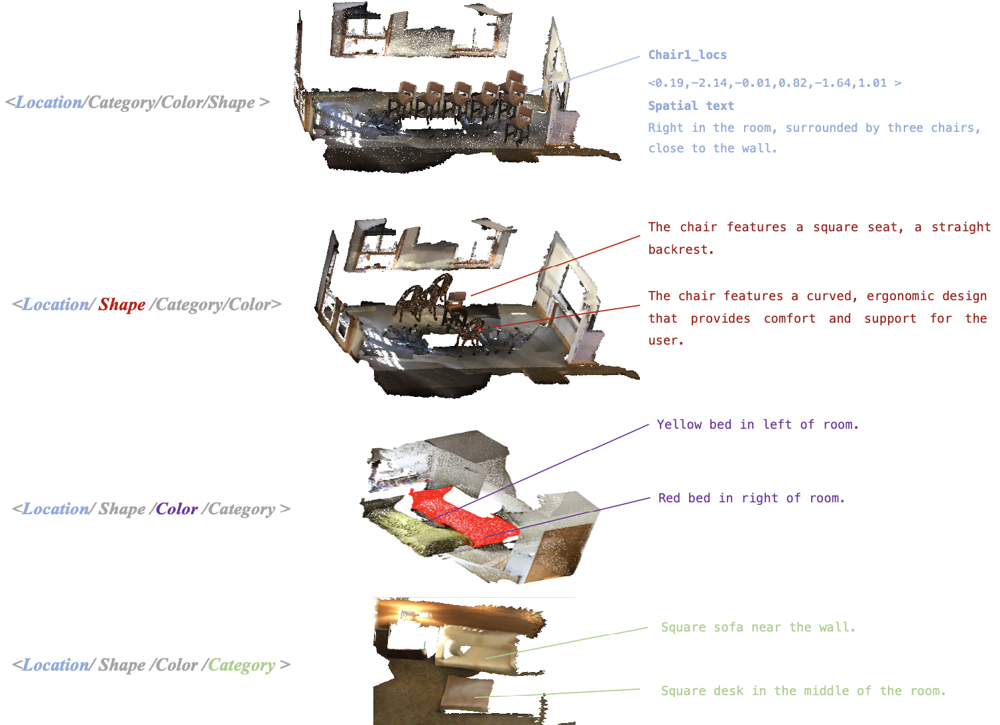

# ObjVariantEnsemble
 This is the official release of **ObjVariantEnsemble: Advancing Point Cloud LLM Evaluation in Challenging Scenes with Subtly Distinguished Object**.

 Here is a small sample of our dataset：

## ToDo List
- [x] Upload our paper and build project pages.
- [x] Accepted to AAAI-2025. 🎉
- [ ] Release our benchmark including challenging scenes. ⏳ *(Processing validation set, coming soon!)*
- [ ] Release the code for our Data Generation Framework, encompassing scene construction and the capture of annotations with key distinguishing information.
